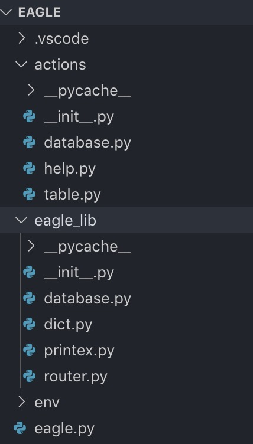
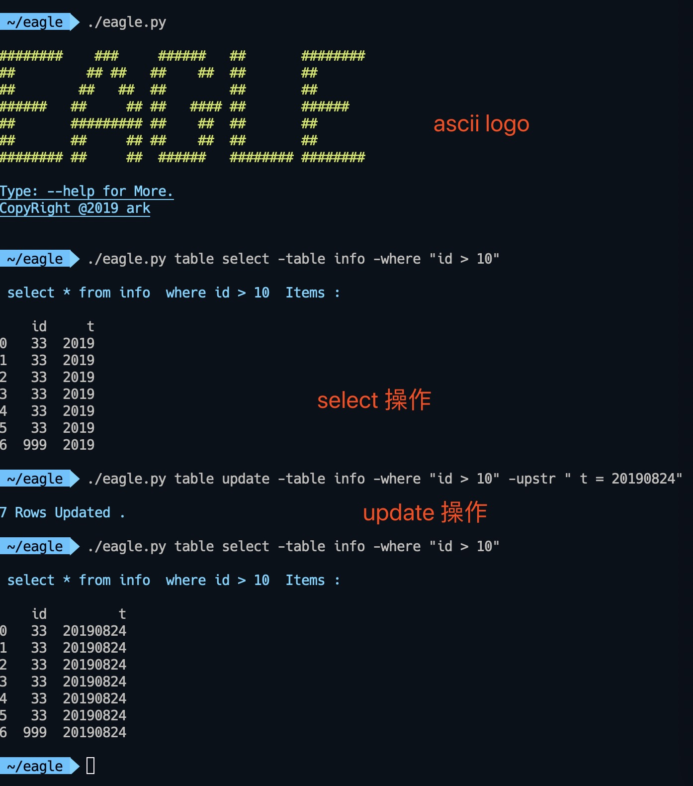

# 使用python3打造一个自己的mysql管理工具库

---

> 使用python3 完成一个mysql 管理的基本工具。 通过这个实例，可以掌握构建一个命令行工具的基本技巧。

## 命令需要的软件包

* Click  用来解析命令行参数
* pymysql 用来访问mysql ，执行sql 语句，是这个工具的底层架构
* colorama 终端下彩色样式的输出，使工具更为美观
* pandas 用来构建数组输出，及后期数据处理

## 命令执行基本结构

click命令行参数解析 -> actions 文件中的入口函数 -> 加载eagle_lib 中基础函数 -> 执行输出

## 基本代码解析

### 参数定义

选择使用 click.option 和 click.argument 这两个包装器来构建命令行参数

定义配置参数
click.option("-name",help="help text",default="eagle",type=click.Text)

* -name 代表传递命令的参数
* help 表示帮助文本
* default 表示该参数的默认值
* type 表示该参数的类型， click 会帮助我们检查参数的正确性

按照顺序，依次定义命令行参数
click.argument("name",default="index")

本实例中使用两个argument 依次为action,def 来简单路由命令行请求到单个文件中的入口函数。该函数接收参数 kwargs 的命名参数字典，用来传递所有的命令行配置选项，依次执行后面的操作。

### 数据库访问

eagle_lib/database.py 中的 dbConnection 定义基础的数据库连接，操作其他的数据库，可以在这里修改。
通过runSql 完成sql 语句的执行操作，

一个查询语句的基本执行
database.runSql(" select * from hello where name = %s ",'ark')

对于对数据库有修改的操作，需要传递参数 commit = True  

返回结果为对应的字典数组，包含对应的查询结果集。如果包含commit 操作，返回操作影响的行数。
如果同时包含了commit 和 命名参数，那么请使用params 命名参数，传递给sql 的参数解析数组。

### 结果集格式化

使用pandas 生成dataframe 对象，该对象可以直接print 成友好的表格样式。

相关命令行参数

* -max_rows 参数可以设置展示的最大行数，默认是100。
* -col_list 用来标记展示的列名，用, 来分割

### 列举一个数据插入的代码实现

```python
def insert(*args,**kwargs):
    tableName,init_fields,init_values = dictEx.dictMget(kwargs,"table","init_fields","init_values")
    if tableName == False or init_fields == False or init_values == False:
        printex.printFalt("Insert Sql Must Have -talbe -init_fields -init_values Field  \n But , %s , %s , %s",tableName,init_fields,init_values)
    sql = "insert  %s (%s) values (%s) " %(tableName,init_fields,init_values)
    affectRows = database.runSql(sql,commit=True)
    printex.printInfo("%d Rows Inserted . ",affectRows)
```

具体思路如下

* 通过dictEx 的dictMget 函数获取多个命令行参数
* 检查参数状态
* 拼装sql 语句
* 执行sql 语句，返回结果

## 部分运行截图，及文件结构

### 项目代码结构



### 项目运行截图

